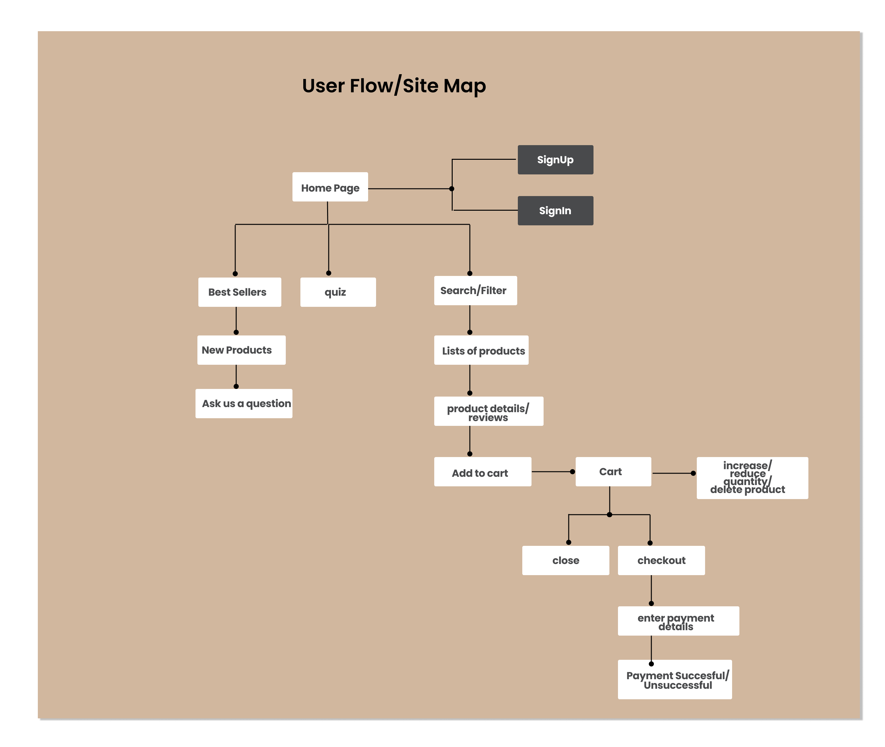
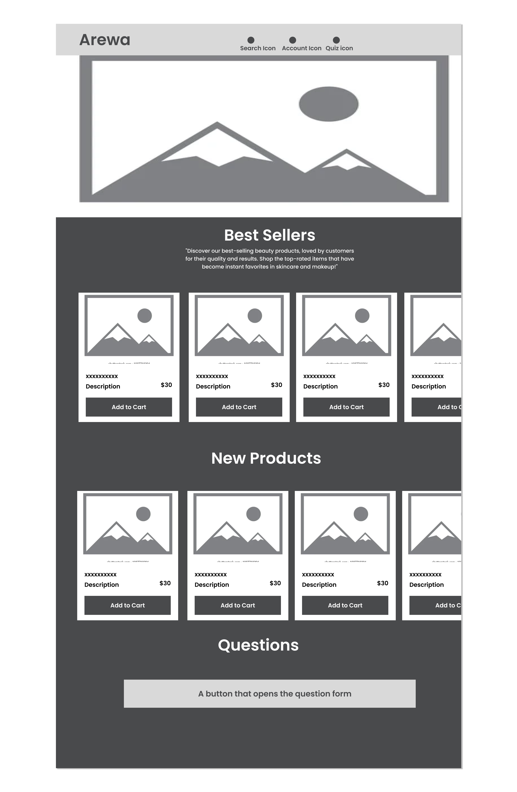
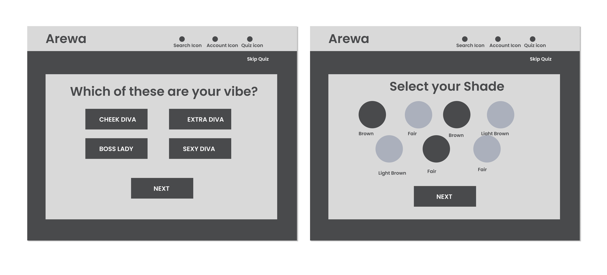
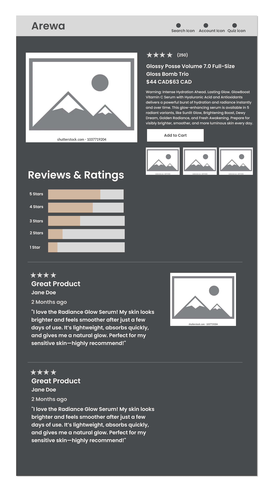
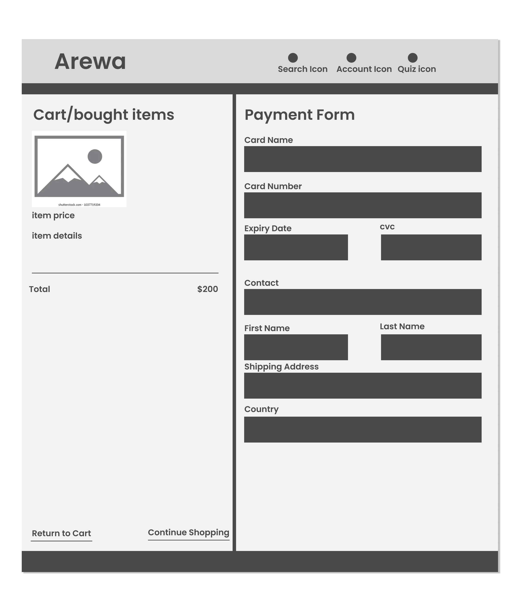
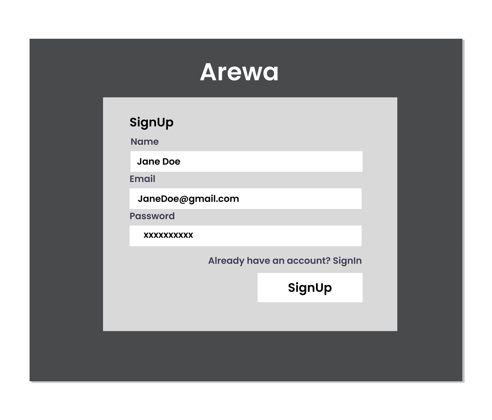

# Project Title

## Overview

Arewa in Yoruba Language means (Beauty), Arewa is a E-commerce web-app for users to find beauty products that suits their needs.
### Problem Space

Beauty means different things to different people. However, as a woman, I can say that being called beautiful is something many of us hold dear. In today’s world, we often hear about the struggle to find the perfect beauty products that truly meet our needs. This is why *Arewa* was created.  

Many users spend endless hours searching websites that don’t prioritize their preferences or needs, often ending up frustrated by a complicated shopping experience. *Arewa* aims to change that by offering a simple, user-friendly solution that understands and caters to individual beauty needs, making the search for the perfect product effortless and enjoyable.  

### User Profile

- Beauty Divas:
  - looking for beauty products that suits their needs
  - Get recommendations based on my preferences
  - Read product reviews and ratings with visuals from previous customers
  - Easy cart management and checkout gateway
  - 
### Features

List the functionality that your app will include. These can be written as user stories or descriptions with related details. Do not describe _how_ these features are implemented, only _what_ needs to be implemented.

## Implementation

### Tech Stack

- React
- JavaScript
- MySQL
- Express
- Client libraries: 
    - react
    - react-router
    - axios
    - react-redux
    - stripe
- Server libraries:
    - knex
    - express
    - cors
    - dotenv
    - stripe
    - bcrypt for password hashing

### APIs

No external APIs will be used i will create my API

### Sitemap

- Home page
- Search
- Quiz
- Lists of Products
- Ask a question
- Product Details/Reviews
- Add to Cart
- Checkout
- SignUp
- SignIn

### Mockups

### Home Page

### Quiz Page

### Product Details Page

### checkout page

### SignUp page

### SignIn Page

### Data

Describe your data and the relationships between the data points. You can show this visually using diagrams, or write it out. 

### Endpoints

List endpoints that your server will implement, including HTTP methods, parameters, and example responses.

## Roadmap

Scope your project as a sprint. Break down the tasks that will need to be completed and map out timeframes for implementation working back from the capstone due date. 

---

## Future Implementations
Your project will be marked based on what you committed to in the above document. Here, you can list any additional features you may complete after the MVP of your application is built, or if you have extra time before the Capstone due date.

