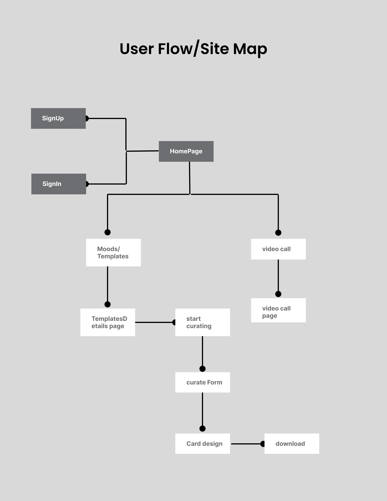
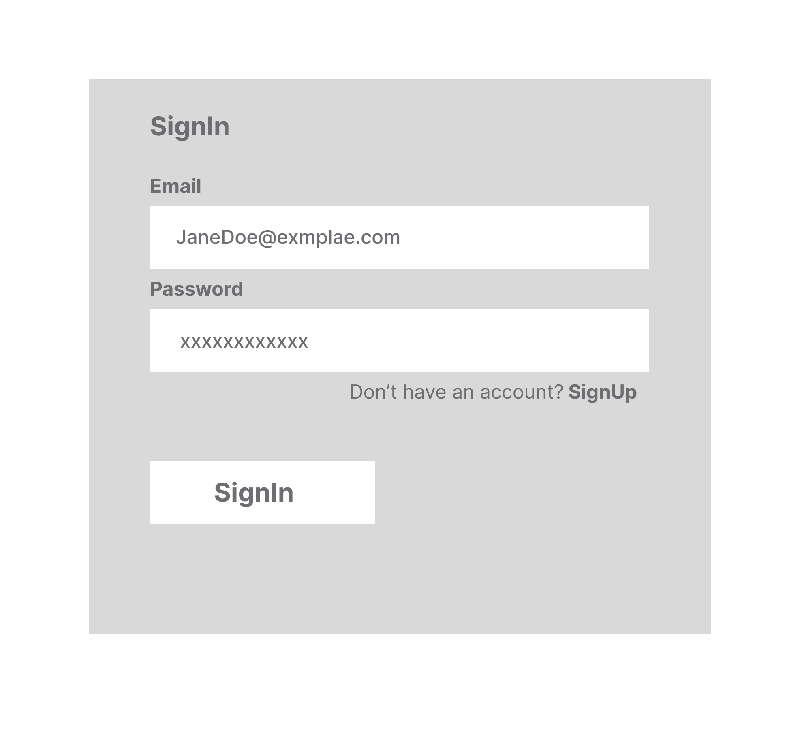
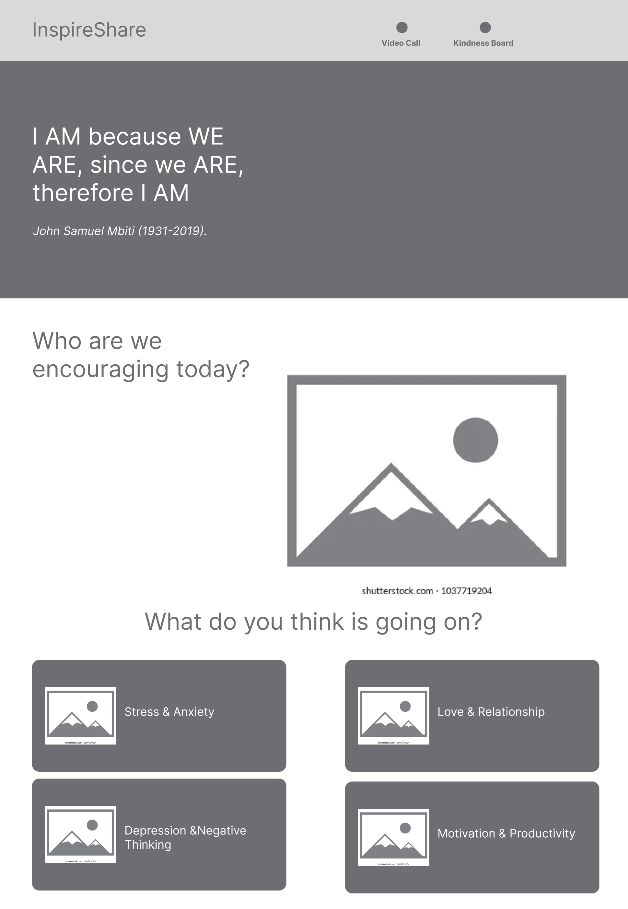
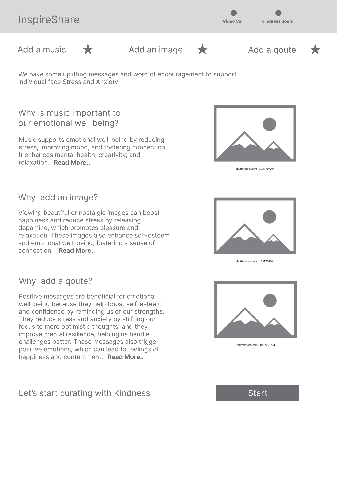
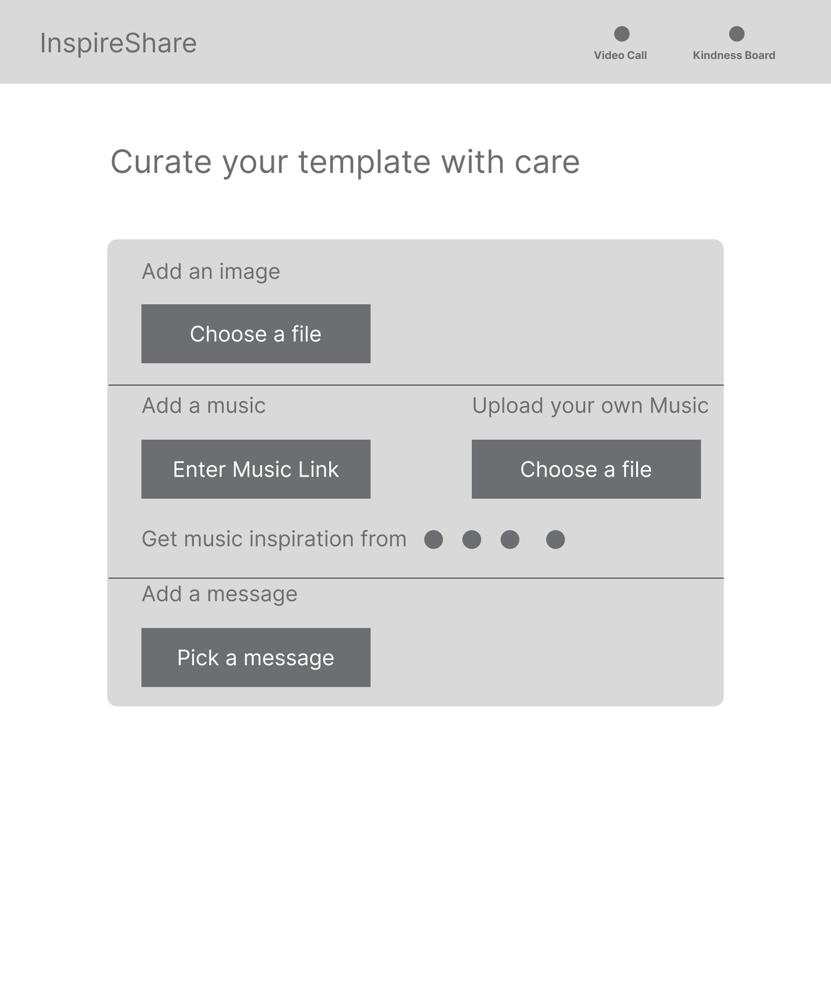
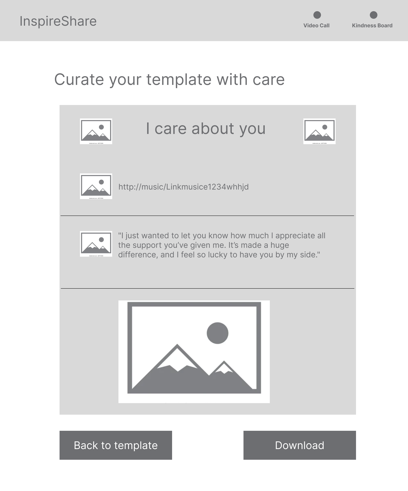
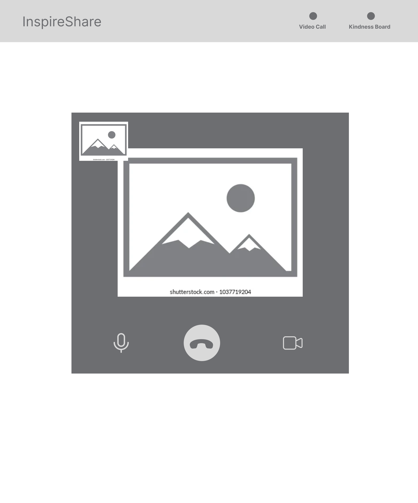

### Project Title:  
InspireShare


### OverVview

InspireShare is an app designed to spread love and positivity by helping users create personalized cards filled with inspirational quotes, music, and images to support friends and loved ones during tough times.  

### Problem Difficulty Expressing Support and Encouragement  
People often struggle to find the right words or meaningful ways to comfort and support friends or loved ones going through tough times. This can lead to feelings of HELPLESNESS or MISSED opportunities to show care and compassion.  

### Key Pain Points:  
1. Lack of Inspiration: Difficulty finding thoughtful, uplifting quotes or words to share.  
2. Time-Consuming: Crafting personalized messages, finding relevant media, and sharing them can feel overwhelming.  
3. Emotional Connection: Generic messages fail to convey the depth of care or understanding desired during emotional moments.  

The app solves this by making it easy to create personalized, meaningful, and shareable expressions of encouragement, combining words, visuals, and music to uplift others effortlessly.It also gives users the option to make a video call to anyone they want to support or encourage.


# ## Usage  
1. Create a Card: Choose a quote, add a personal music link, and upload a photo or image.  
2. Add Music: Search and attach a Spotify or YouTube link to the card for an emotional touch.  
3. Share: Send the card directly to a friend via email, messaging apps, or social media. 
4. video Call: A video call might be a better option for some users. 


## Features 

- As a user, i want to be able to select quotes without wasting time browisng the internet.
- As s user i don't have to master design tools before i can make a beautify lovely card design.

- As a user i don't want to share music, images, and qoutes separately (it's time consuming)
- As a user i want to be able to download the card without any hassle
- As a user i want to be to make a video call when i don't really have much time to curate a card.


- Inspirational Quote Library: select random quotes categorized by themes such as resilience, hope, and positivity.  
- Customizable Cards: Add personal touches with images, music links, and customized messages.  
- Music Integration: Include meaningful music via Spotify or YouTube links.  
- Shareable Creations: Send cards directly to friends or share them on social platforms.   
- Daily Inspiration: Receive daily quotes to keep your positivity flowing OR leaderboard, streaks(oh what a great person you are you sent 5 support cards this week).  

---

## Implementation 

### Tech Stack

- React
- JavaScript
- Express
- MySql


- Client Libraries:
    - react
    - react-router
    - axios
    - Twilio
    - jspdf
    -react-youtube

- Server Libraries:
    - express
    - knex
    - Twilio


---
### APIs

- No external APIs will be used i will develop my own API

---

### Sitemap


- Register/LogIn
- Homepage
- choose the "supportee's mood/template
- TemplateDetails
- Card/Download
- Video Call

### Mockups

### SignUp Page


### SignIn Page


### Home Page


### TemplateDetails Page


### Curate Template Page


### Card design Page


### Video Page



## Data 

---

### Endpoints


**GET /Qoutes/stress**

Response:
````
[
  {
    "id": 1,
    "title": "To the Brave You",
    "message":""To the Brave You: Even when the path feels impossible, remember that your heart has already overcome so much. The courage you carry inside is stronger than any fear. Keep going, because your bravery will light the way, even in the darkest moments.""
  },
]

````
**GET /Qoutes/relationship**

Response:
````
[
  {
    "id": 1,
    "title": "Be happy",
    "message":"Heartbreak doesn’t mean you’ve failed, it just means you gave your heart to someone who wasn’t ready for it. It’ll hurt, but you’ll learn to love yourself even more through this."
  },
]

````
**GET /Qoutes/depression**

Response:
````
[
  {
    "id": 1,
    "title": "Be happy",
    "message":"Heartbreak doesn’t mean you’ve failed, it just means you gave your heart to someone who wasn’t ready for it. It’ll hurt, but you’ll learn to love yourself even more through this."
  },
]

````

**GET /token**

  - backend token request set up for client side
  {
  "token": "eyJhbGciOiJ-SAMPLE-YmKdvciQST2VfjiUz4-M3Wl-T0kOg==",
  "identity": "foo@company.com",
  "room": "room_name",
  "type": "video"
}


  - Response for client side
  [
    {
      "token": "SAMPLE_twilio_jwt_token_here"
    }
  ]

---

**POST /users/signUp**

- Add a user account

Parameters:
- name: User's name
- email: User's email
- password: User's provided password

Response:
````
[
  {
    "token": "SAMPLE_signUp_jwt_token_here"
  },
]

````
**POST /users/SignIn**

- SignIn a user account

Parameters:

- email: User's email
- password: User's provided password

Response:
````
[
  {
    "token": "SAMPLE_signUp_jwt_token_here"
  },
]

````


### Roadmap

- Create client
   - react project with routes 
   - install all the necessary libraries

- Create server
  - express project with routing, with placeholder 200 responses

- Create migrations

- Create endpoints for qoutes

- Create endpoints to implement twilio video jwt token

- Feature: HomePage
  - list of 'supportee's mood'/template
  - Create a GET request for quotes that is tailored for each mood

- Feature: TemplateDetails page
  - implement view template/mood page
  - implement brief advantage of each support

- Feature: Curate-Template page
  - implement a template page where images,music & qoute can be added to form
  - Create a GET /qoutes/stress or any mood dierectory

- Feature: Card Page
  - implement the final card design page 
  - install jspdf library
  - implement a download pdf button

- Feature: Video Page
  - implement a video call page 
  - Create a GET /token
  - implement make/answer video call buttons
  

## Future Implementations 
- Add anonymous sharing feature.  
- Introduce gamification with badges and rewards.  
- Expand quote categories and support for multiple languages.  
- Implement AI suggestions for quotes and card designs.  
---